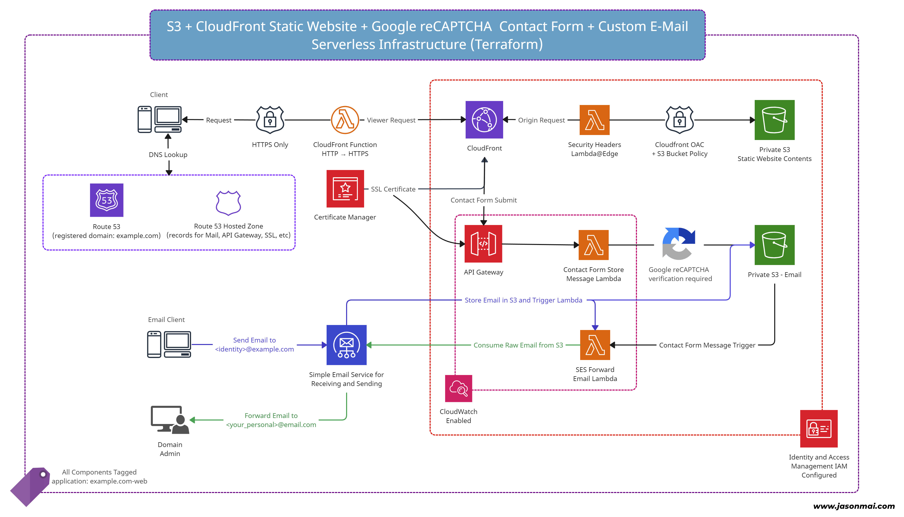
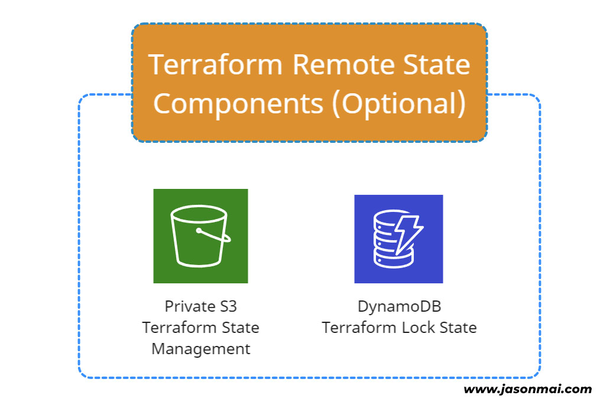
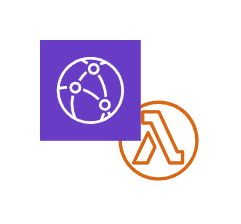

# Vite + React + TypeScript + Google reCAPTCHA + Email <br>AWS Serverless Static Website Starter Kit
[](https://github.com/jasonmai/serverless-email-react-starter/actions/workflows/cicd.yml)
TODO: coverage badge here

:sparkles:A completely serverless, end-to-end, :zap:static website starter application that includes the full
[Terraform](https://www.terraform.io/) [AWS](https://aws.amazon.com/) infrastructure 💯, lambdas required for backend
(tested 🧪 and configured), and a working [Vite](https://vitejs.dev/) + [React](https://react.dev/) +
[TypeScript](https://www.typescriptlang.org/) starter application :rocket: with a 
[Google reCAPTCHA](https://www.google.com/recaptcha/) form :lock: plus testing baked in:boom:. :rocket::rocket::rocket:

  * :white_check_mark: Have your own domain name, or plan on purchasing one?
  * :white_check_mark: Have an AWS account?
  * :white_check_mark: Want to create any email address `@your_domain.com` and receive emails from it?
  * :white_check_mark: Want a fully serverless static website that is fully under your control?
  * :white_check_mark: Want a protected contact me section that sends messages directly to your email?
  * :white_check_mark: Want to pay less than a dollar a month for maintenance?

OR 

  * :white_check_mark: Have your own domain and just want to receive emails from a custom address `@your_domain.com`?
  * :white_check_mark: Want a fully configured [Vite](https://vitejs.dev/) + [React](https://react.dev/) +
    [TypeScript](https://www.typescriptlang.org/) + [Lint](https://eslint.org/) +
    [SASS](https://sass-lang.com/) + [React Testing Library](https://testing-library.com/docs/react-testing-library/intro/)
    starter project complete with example unit tests and coverage?
  * :white_check_mark: Have your own static web application and need an infrastructure to provision it on?

Then this package might just be perfect for you! 👌 (see the [live demo](https://leggo.dog))

Check out the [Components](#components-) section and [Architecture Diagram](#architecture-diagram-) to see how it works! 👀 <br>

## Table of Contents 📜
* [Features ✨](#features-)
* [Creates 🎁](#creates-)
* [Tech Stack 🥞](#tech-stack-)
* [Prerequisites ✅](#prerequisites-)
* [Quick Start 🐇](#quick-start-)
    * [Step 1.](#step-1)
    * [Option A](#option-a-using-the-provisioning-scripts)
    * [Option B](#option-b-performing-steps-manually)
    * [Future Deployments/Updates](#future-deploymentsupdates)
    * [Destroy/Tear Down](#destroy--tear-down)
* [Project Structure 🧱](#project-structure-)
* [Components 🧩](#components-)
    * [App 💎](#app-)
    * [Lambdas 🤖](#lambdas-)
    * [Terraform 🏗️](#terraform-%EF%B8%8F)
* [Scripts 📃](#scripts-)
* [Architecture Diagram 📐](#architecture-diagram-)
* [Infrastructure Resources 🧰](#infrastructure-resources-)
* [Troubleshooting 🛠️](#troubleshooting-%EF%B8%8F)
* [License ⚖️](#license-%EF%B8%8F)

## Features ✨

 * 🤑 Cost optimized serverless static website application (no servers, low maintenance, low cost)
 * 📧 Receive emails from custom email addresses out of box (based on email forwarding)
 * 🌐 Optimized for serverless operation and deployment to CDN edge locations [AWS CloudFront](https://aws.amazon.com/cloudfront/)
 * 🔒 HTTPS enabled along with HTTP -> HTTPS redirects
 * 🛡 [Google reCAPTCHA](https://www.google.com/recaptcha/) contact me form functionality baked into the back end and front end
 * 🔥 Hot module replacement during local development using [Vite](https://vitejs.dev/) + [React](https://react.dev/)
 * ✅ Pre-configured with code quality tools: [ESLint](https://eslint.org/), [Prettier](https://prettier.io/),
   [TypeScript](https://www.typescriptlang.org/), [Vitest](https://vitest.dev/),
   [React Testing Library](https://testing-library.com/docs/react-testing-library/intro/) etc.
 * 🏎 Easy to follow provisioning scripts to help you get started quickly
 * 💯 All code 100% unit tested with coverage ([RTL](https://testing-library.com/docs/react-testing-library/intro/) for React app and [Jest](https://jestjs.io/) for lambdas)

## Creates 🎁
After you provision this project, you will have the following :sparkles::
 * 🚀 `https://<your_domain_name>` will be live! Hosting your SPA (also, `www.<your_domain_name>` & HTTP -> HTTPS)
 * ⚡ `https://api<your_domain_name>/contact` will be a REST API **POST** endpoint you can `curl`
   ```shell
   curl -X POST https://api.<your_domain_name>/contact -H "Content-Type: application/json" \
     -d '{"name": "Test Name", "email": "test@email.com", "message": "Testing", "recaptchaToken": "token-that-will-fail"}'
   ```
 * 🛡 [Google reCAPTCHA](https://www.google.com/recaptcha/) contact me form on `https://<your_domain_name>` will send messages to your email
 * 📭 Custom emails addresses `@<your_domain_name>` will forward received emails to your personal email 
 * 📧 `mail.<your_domain_name>` record that acts as your `MAIL FROM`
 * 🤹🏻 and much more behind the scenes

## Tech Stack 🥞
| Area                    | Stack                                                                                                                                                                                                                                                                                                                                                                                                                                                                                                                                                      |
|-------------------------|------------------------------------------------------------------------------------------------------------------------------------------------------------------------------------------------------------------------------------------------------------------------------------------------------------------------------------------------------------------------------------------------------------------------------------------------------------------------------------------------------------------------------------------------------------|
| 💎&nbsp;Front End       | [NPM](https://www.npmjs.com/), [Vite](https://vitejs.dev/), [React](https://react.dev/), [TypeScript](https://www.typescriptlang.org/), [SASS](https://sass-lang.com/), [React Hook Form](https://react-hook-form.com/), [Google reCAPTCHA](https://github.com/dozoisch/react-google-recaptcha), [ESLint](https://eslint.org/), [Prettier](https://prettier.io/), [Vitest](https://vitest.dev/), [React Testing Library](https://testing-library.com/docs/react-testing-library/intro/), [jsdom](https://github.com/jsdom/jsdom), [MSW](https://mswjs.io/) |
| 🤖&nbsp;Lambdas         | [NPM](https://www.npmjs.com/), [TypeScript](https://www.typescriptlang.org/), [ESLint](https://eslint.org/), [Prettier](https://prettier.io/), [Rollup](https://rollupjs.org/), [Jest](https://jestjs.io/), [AWS Lambda SES Forwarder](https://github.com/arithmetric/aws-lambda-ses-forwarder)                                                                                                                                                                                                                                                            |
| 🏗️&nbsp;Infrastructure | [Terraform](https://www.terraform.io/), [Bash](https://www.gnu.org/software/bash/), [Amazon Web Services](https://aws.amazon.com/) (Route53, S3, CloudFront, CFF, ACM, SES, Lambda, API Gateway, CloudWatch, IAM)                                                                                                                                                                                                                                                                                                                                          |

## Prerequisites ✅

What you will need before you begin 📝:

 * [Amazon Web Services account](https://aws.amazon.com/)
 * [AWS CLI](https://aws.amazon.com/cli/) and [credentials](https://docs.aws.amazon.com/cli/latest/userguide/getting-started-quickstart.html) set up on your system
 * [Google reCAPTCHA](https://www.google.com/recaptcha/admin/create) account set up with
   [reCAPTCHA v2 - Invisible](https://developers.google.com/recaptcha/docs/invisible) site created
   (ensure to configure your `Security Preference` correctly)
 * [Terraform](https://developer.hashicorp.com/terraform/tutorials/aws-get-started/install-cli) CLI [installed](https://developer.hashicorp.com/terraform/tutorials/aws-get-started/install-cli)
 * [Registered Domain Name in AWS Route53](https://docs.aws.amazon.com/Route53/latest/DeveloperGuide/domain-register.html) - this is a domain name that you own
   * (Note: You can still use this project if you own a domain name outside of AWS. However, you will need to
     make the appropriate modifications/configurations to your domain name and in this project. Your domain name
     must be pointing to the correct name servers in the records within the Route53 hosted zone this project will
     create for your infrastructure)
 * [NodeJS](https://nodejs.org/) installed
 * [NPM](https://www.npmjs.com/) installed

## Quick Start 🐇

There are **2 ways** you can get setup and deployed :rocket::
<ol type="A">
  <li>Using the provided <b>provisioning scripts</b> in the <code>/scripts</code> directory</li>
  <li>Perform steps/commands <b>manually</b></li>
</ol>

### Step 1.
This step is ***OPTIONAL*** if you plan on going with [**Option A**](#option-a-using-the-provisioning-scripts) (using
provisioning scripts). The provisioning scripts can automate this step by asking you a series of questions only if you
choose to.
 1. (*OPTIONAL*) Set up the configuration files:
    1. `app/.env`
        1. Make a copy of the file `app/.env.template` renamed in the same folder: `app/.env`
        2. Edit the file so that it has the correct values
           (i.e. `example.com` should be your domain name and `TEST_TOKEN` should be your Google reCAPTCHA `SITE KEY`)
    2. `terraform/secrets.tfvars`
        1. Make a copy of the file `terraform/secrets.tfvars.template` renamed in the same folder: `terraform/secrets.tfvars`
        2. Edit the file so that your Google reCAPTCHA `SECRET KEY` is in between the quotes
    3. `terraform/terraform.tfvars`
        1. Make a copy of the file `terraform/terraform.tfvars.template` renamed in the same folder: `terraform/terraform.tfvars`
        2. Edit the file so that it has the correct values
           (you can find descriptions of variables in `terraform/variables.tf` if neccessary)

### Option A: Using the provisioning scripts
  1. Ensure **all prerequisites** have been met
  2. Run the **provisioning script** and follow the steps:
     ```shell
     cd scripts
     ./provision_tfstate_and_application.sh
     ```
  3. Check your personal email address (spam/junk as well) for any verification emails and accept them
  4. Go to your domain, you should see your static website up and running! (test the contact form)

Note: After everything is complete, you can re-run any of
 * `./provision_tfstate_and_application.sh`
 * `./provision_application.sh --skip-all-prompts`

without harm for future deployments. If there are no changes, it should be idempotent.
No operations will be performed on the infrastructure if no changes have been made.

### Option B: Performing steps manually
  1. Ensure **all prerequisites** have been met
  2. Ensure you've completed **Step 1.**
  3. Go into the **lambdas** folder then build and install the project:
     ```shell
     cd lambdas
     npm ci
     npm run build
     ```
  4. Go into the **App** folder then **build** and **install** the project:
     ```shell
     cd app
     npm ci
     npm run build
     ```
  5. Decide whether you would like **remote** or **local** state management with **Terraform** and then **initialize** the project:
     1. **Remote state** (good for multiple contributors and not worrying about VC)
         * Provision the **Terraform Remote Backend** infrastructure and then initialize the **Terraform** project:
           ```shell
           cd terraform-remote-backend
           terraform init
           terraform apply -var "domain_name=<YOUR_DOMAIN_NAME_HERE>"
           cd ../terraform
           echo "NOTICE: Make sure to replace the dot in your domain name with an underscore for the table value"
           terraform init \
               -backend-config "bucket=terraform-tfstate-<YOUR_DOMAIN_NAME_HERE>-web" \
               -backend-config "key=prod/terraform.tfstate" \
               -backend-config "region=us-east-1" \
               -backend-config "dynamodb_table=terraform-tfstate-<YOUR_DOMAIN_NAME_HERE_REPLACE_DOT_WITH_UNDERSCORE>-web"
           ```
     2. **Local state** (less infrastructure and total control locally)
         * Go into the **Terraform** folder and configure the `terraform/.provider.tf` file
         * Uncomment the `backend "local"` block of code (L10-L12)
         * Comment out the `backend "s3"` block of code (L13-L20)
         * Initialize the **Terraform** project:
           ```shell
           cd terraform
           terraform init
           ```
  6. **Deploy** the **Terraform** infrastructure along with the entire project
      * Decide whether you want to use the **provision script** or run commands **manually** from this point:
          1. Using **provision script** (skip all questions since files configured)
             ```shell
             cd scripts
             ./provision_application.sh --skip-all-prompts         
             ```
          2. Run commands **manually**
             ```shell
             cd terraform
             terraform apply --var-file="secrets.tfvars"
             ```
  7. Check your personal email address (spam/junk as well) for any verification emails and accept them
  8. Go to your domain, you should see your static website up and running! (test the contact form)

Note: After everything is complete, you can re-run any of
* `./provision_tfstate_and_application.sh`
* `./provision_application.sh --skip-all-prompts`

without harm for future deployments. If there are no changes, it should be idempotent.
No operations will be performed on the infrastructure if no changes have been made.

### Future Deployments/Updates
After you've made any changes to your project, infrastructure, or configuration files follow one of **OPTION I** or
**OPTION II** (steps from [Option B](#option-b-performing-steps-manually), step 6. above).
  * **OPTION I**: Using **provision script** (skip all questions since files configured)
     ```shell
     cd scripts
     ./provision_application.sh --skip-all-prompts         
     ```
  * **OPTION II**: Run commands **manually** AFTER building lambda project and react project
     ```shell
     cd terraform
     terraform apply --var-file="secrets.tfvars"
     ```

**Note**: Since the static web files are behind CloudFront CDN, changes uploaded will not be apparent right
          away because they're cached by CloudFront. You may want to invalidate the cache. The provision
          script will do this for you:
```shell
./provision_application.sh --skip-all-prompts
```
OR you can perform this invalidation yourself through the **AWS Web Console** or **AWS CLI**:
```shell
aws cloudfront create-invalidation --distribution-id <YOUR_CLOUDFRONT_DISTRIBUTION_ID> --paths '/*'
```

### Destroy / Tear Down
To destroy or tear down the infrastructure provisioned by this project, follow one of **OPTION I** or **OPTION II**:
* **OPTION I**: Using **destroy script**
   ```shell
   cd scripts
   ./destroy.sh
   ```
* **OPTION II**: Run destroy command **manually** 
   ```shell
   cd terraform
   terraform destroy --var-file="secrets.tfvars"
   ```

## Project Structure 🧱
`├──`[`.github`](.github) — [GitHub actions](https://github.com/features/actions) CI/CD workflow (does not perform Terraform deploys *yet*)<br>
`├──`[`app`](./app) — [Vite](https://vitejs.dev/) + [React](https://react.dev/) + [TypeScript](https://www.typescriptlang.org/) + [Google reCAPTCHA](https://www.google.com/recaptcha/) front end starter project ([see here](#app-))<br>
`├──`[`diagrams`](./diagrams) — Diagrams for `README.md`<br>
`├──`[`lambdas`](./lambdas) — Serverless [AWS lambda functions](https://aws.amazon.com/lambda/) required for the backend infrastructure ([see here](#lambdas-))<br>
`├──`[`scripts`](./scripts) — Automation bash scripts for provisioning the infrastructure and application ([see here](#scripts-))<br>
`├──`[`terraform`](./terraform) — [Terraform](https://www.terraform.io/) modules and configs for provisioning the infra and app ([see here](#terraform-%EF%B8%8F))<br>
`└──`[`terraform-remote-backend`](./terraform-remote-backend) — [Terraform](https://www.terraform.io/) code for provisioning remote state management<br>

## Components 🧩
There are **3 main components** to this project: [**App**](#app-), [**Lambdas**](#lambdas-), and
[**Terraform**](#terraform-%EF%B8%8F).

Note: The **Terraform** project depends on the **Lambdas** project  to fully create a working backend.

### App 💎
 * [Vite](https://vitejs.dev/) + [React](https://react.dev/) + [TypeScript](https://www.typescriptlang.org/) +
   [Google reCAPTCHA](https://www.google.com/recaptcha/) starter project
 * **Independent** component (subproject with no dependence on the other components)
 * Project script commands: <br>
   | Command | Description | 
   |---------|-------------|
   | <code>npm&nbsp;run&nbsp;dev</code> | Run application in development mode with [hot module replacement](https://vitejs.dev/guide/api-hmr) |
   | <code>npm&nbsp;run&nbsp;dev:net</code> | Same as `npm run dev` but exposes to network (test with different devices on your network) |
   | <code>npm&nbsp;run&nbsp;lint</code> | Run linter [ESlint](https://eslint.org/) on all files |
   | <code>npm&nbsp;run&nbsp;test</code> | Run all unit tests with [vitest](https://vitest.dev/) + coverage with [v8](https://v8.dev/) (outputs to `./coverage`) |
   | <code>npm&nbsp;run&nbsp;build</code> | Build the application and minify (outputs to `./dist`) |
   | <code>npm&nbsp;run&nbsp;build:prod</code> | Runs linter, test with coverage, and build with minification |
   | <code>npm&nbsp;run&nbsp;analyze</code> | Run the [bundle visualization tool](https://github.com/KusStar/vite-bundle-visualizer) (outputs to `visualize-bundle.html`) |
   | <code>npm&nbsp;run&nbsp;preview</code> | Hosts a webserver on the distribution folder `./dist` (useful for preview of non-dev app behaviour) |
   | <code>npm&nbsp;run&nbsp;preview:net</code> | Same as `npm run preview` but exposes to network |

### Lambdas 🤖
 * Contains the **4 serverless functions** required for the backend infrastructure to work, organized by their triggers<br>
   | Trigger | Function | Description |
   | ------- | -------- | ----------- |
   | [API Gateway](https://aws.amazon.com/api-gateway/) | <code>store&#8209;message.ts</code> | Lambda function for storing raw messages from the [Google reCAPTCHA](https://www.google.com/recaptcha/) contact form in [S3](https://aws.amazon.com/s3/) |
   | [CFF](https://docs.aws.amazon.com/AmazonCloudFront/latest/DeveloperGuide/cloudfront-functions.html) | <code>viewer&#8209;request.ts</code> | [CloudFront Function](https://docs.aws.amazon.com/AmazonCloudFront/latest/DeveloperGuide/cloudfront-functions.html) that is attached to the viewer request event for `www` redirects and URL rewrites |
   | [Lambda@Edge](https://aws.amazon.com/lambda/edge/) | <code>origin&#8209;response.ts</code> | Lambda function attached to [CloudFront](https://aws.amazon.com/cloudfront/) origin response event for adding security response headers |
   | [SES](https://aws.amazon.com/ses/)/[S3](https://aws.amazon.com/s3/) | <code>forward&#8209;email.ts</code> |  Lambda that handles sending form messages and forwarding incoming emails to your personal email address |
 * Project structure: <br>
   `lambdas`<br>
   `   └─ src`<br>
   `       ├──`[`api-gateway`](./lambdas/src/api-gateway) — code and tests for `store-message` lambda<br>
   `       ├──`[`cloudfront-function`](./lambdas/src/cloudfront-function) — code and tests for `viewer-request` function<br>
   `       ├──`[`edge`](./lambdas/src/edge) — code and tests for `origin-response` lambda<br>
   `       └──`[`ses-s3`](./lambdas/src/ses-s3) — code and tests for `foward-email` lambda<br>
 * **Independent** component (subproject with no dependence on the other components)
 * Project script commands: <br>
   | Command | Description |
   |---------|-------------|
   | <code>npm&nbsp;run&nbsp;lint</code> | Run linter [ESlint](https://eslint.org/) on all files |
   | <code>npm&nbsp;run&nbsp;test</code> | Run all unit tests across the different lambdas with coverage using [Jest](https://jestjs.io/) (outputs to `./coverage`) |
   | <code>npm&nbsp;run&nbsp;build:nominify</code> | Build all lambdas without minification (outputs to `./dist`) |
   | <code>npm&nbsp;run&nbsp;build</code> | Build all lambdas with minification (outputs to `./dist`) |
   | <code>npm&nbsp;run&nbsp;build:prod</code> | Runs linter, test with coverage, and build with minification |

### Terraform 🏗️
 * Contains the Terraform code/modules to provision the AWS infrastructure for the entire project<br>
   (see [Infrastructure Resources](#infrastructure-resources-))
 * **Depends on Lambdas**: the provisioned infrastructure requires the lambdas to be built in order for everything
   to work properly end-to-end
 * Does not depend on **App**: it will deploy an empty website if no static web files provided
   (you will need to populate the `./app/dist` folder yourself)
 * Project commands: <br>
   | Command | Description |
   |---------|-------------|
   | <code>terraform&nbsp;init</code> | [Initialize](https://developer.hashicorp.com/terraform/cli/commands/init) the **Terraform** project |
   | <code>terraform&nbsp;fmt&nbsp;-recursive</code> | [Format](https://developer.hashicorp.com/terraform/cli/commands/fmt) all **Terraform** code in project |
   | <code>terraform&nbsp;validate</code> | [Validate](https://developer.hashicorp.com/terraform/cli/commands/validate) the **Terraform** project |
   | <code>terraform&nbsp;plan</code> | [Plan to preview](https://developer.hashicorp.com/terraform/cli/commands/plan) the **Terraform** changes before applying them |
   | <code>terraform&nbsp;apply&nbsp;&#8209;&#8209;var&#8209;file="secrets.tfvars"</code> | [Apply to provision](https://developer.hashicorp.com/terraform/cli/commands/apply) the **Terraform** project pointing to the required `secrets.tfvars` file |
   | <code>terraform&nbsp;destroy&nbsp;&#8209;&#8209;var&#8209;file="secrets.tfvars"</code> | [Destroy](https://developer.hashicorp.com/terraform/cli/commands/destroy) all **Terraform** provisioned infrastructure |

## Scripts 📃
Included with this project are scripts to make configuration, provisioning, and destroying easier.
All scripts reside in the `./scripts` folder and should be executed in the same directory. To use a script, in a shell
`cd` into the scripts directory (`cd scripts`) and then run `./<script_name>.sh`.

| Script Name                            | Description                                                                                                                                                                                                                                                                                                                                                                                                                                                                                                                        |
|----------------------------------------|------------------------------------------------------------------------------------------------------------------------------------------------------------------------------------------------------------------------------------------------------------------------------------------------------------------------------------------------------------------------------------------------------------------------------------------------------------------------------------------------------------------------------------|
| `provision_tfstate_and_application.sh` | Script for setting up project from scratch. It will provision a remote [Terraform](https://www.terraform.io/) state management backend, generate configuration files for you through asking questions (if you choose to), build all project files, and then continue to provision the entire application. For more information check out [Quick Start: Option A](#option-a-using-the-provisioning-scripts)                                                                                                                         |
| `provision_application.sh`             | Script for provisioning the entire application, assuming you already have [Terraform](https://www.terraform.io/) initialized (it can initialize for you if you don't). It generates configuration files for you through asking questions (if you choose to), builds all project files, and then continues to provision the entire application. The script `provision_tfstate_and_application.sh` executes this script at the end. For more information check out [Quick Start: Option A](#option-a-using-the-provisioning-scripts) |
| `destroy.sh`                           | Script for destroying all provisioned infrastructure for the project. It will also ask if you want to destroy the [Terraform](https://www.terraform.io/) remote state resources at the end                                                                                                                                                                                                                                                                                                                                         |
| `destroy_remote_tfstate.sh`            | Script for destroying the infrastructure resources used for [Terraform](https://www.terraform.io/) remote state management. Do not use this if you still have provisioned application infrastructure, otherwise you will have to manually remove all provisioned resources when you no longer want them. The script `destroy.sh` executes this script at the end                                                                                                                                                                   |
| `common.sh`                            | This file is not meant to be run on its own. It contains helper functions shared across scripts                                                                                                                                                                                                                                                                                                                                                                                                                                    |

## Architecture Diagram 📐
How the backend infrastructure works (all static project files are in the `Static Website Contents` S3 bucket):
<p align="center">
    <a href="https://raw.githubusercontent.com/jasonmai/serverless-email-react-starter/main/diagrams/infrastructure.jpg">
        
    </a>
    <a href="https://raw.githubusercontent.com/jasonmai/serverless-email-react-starter/main/diagrams/infrastructure-terraform.jpg">
        
    </a>
</p>

## Infrastructure Resources 🧰
<table>
  <thead>
    <tr>
      <th>AWS Resource</th>
      <th>Purpose</th>
    </tr>
  </thead>
  <tbody>
    <tr>
      <td align="center">
        <br>
        Route 53<br>
        <br>
        Route 53 Hosted Zones
      </td>
      <td>
        Used for domain level configurations and routes:
        <ul>
          <li>
            Registered Domain: Created for syncing the name servers between
            purchased domain names and created hosted zones
          </li>
          <li>
            Hosted Zone: Created to hold records for the registered domain
          </li>
          <li>
            Record: Used to create all the necessary records to enable all website functionality:
            <ul>
              <li>Create <code>Root</code> <code>A</code> record for mapping domain to Cloudfront distribution</li>
              <li>Create <code>WWW</code> <code>A</code> record for mapping WWW subdomain of the main domain </li>
              <li>Create <code>api</code> <code>A</code> record for mapping <code>api.&lt;domainname&gt;.com</code> to API Gateway edge locations</li>
              <li>Create <code>MX</code> and <code>TXT</code> records required for email functionality on domain name</li>
              <li>Create <code>MX</code> and <code>TXT</code> records required for email functionality on<br><code>mail.&lt;domainname&gt;.com</code></li>
              <li>Create DKIM verification records to map SES to domain name</li>
              <li>Create certificate validation records for creating SSL certificates on domain name through ACM</li>
            </ul>
          </li>
        </ul>
      </td>
    </tr>
    <tr>
      <td align="center">
        <br>
        S3 Bucket
      </td>
      <td>
        Necessary for creating a bucket that holds the contents of the static website and a bucket for emails:
          <ul>
            <li><code>&lt;domainname&gt;</code>: Static website files</li>
            <li>
              <code>&lt;domainname&gt;-email</code>: Raw email messages in <code>/inbox</code> (from SES) and
              <code>/contact-form-inbox</code> (from contact form)
            </li>
            <li>Terraform S3 Object is used to upload all static website files to <code>&lt;domainname&gt;</code> bucket</li>
          </ul>
      </td>
    </tr>
    <tr>
      <td align="center">
        <br>
        CloudFront
      </td>
      <td>The CDN for the main static website</td>
    </tr>
    <tr>
      <td align="center">
        <br>
        CloudFront Functions
      </td>
      <td>
        Used to create a viewer request event function <code>viewer-request</code> that redirects http to HTTPS
        and map routes ending <code>/</code> to the corresponding <code>index.html</code> files
      </td>
    </tr>
    <tr>
      <td align="center">
        <br>
        ACM
      </td>
      <td>Used to create the SSL/HTTPS certificates for the domain name and API usages</td>
    </tr>
    <tr>
      <td align="center">
        <br>
        SES
      </td>
      <td>
        Used to enable creating of email identities on the domain name
          <ul>
            <li>Create email identities such as <code>mail@&lt;domainname&gt;</code> and <code>hello@&lt;domainname&gt;</code></li>
            <li>Verify personal emails to allow forwarding (i.e. <code>&lt;your_personal_email&gt;@gmail.com</code>)</li>
            <li>
              Set up email receiving rule to store received raw emails in S3 and
              connect to a lambda that forwards emails to personal email accounts
            </li>
          </ul>
      </td>
    </tr>
    <tr>
      <td align="center">
        <br>
        Lambda
      </td>
      <td>
          Used to create several lambda functions essential to the core functionality of the website:
          <ul>
            <li>
              <code>origin-response</code>: Lambda@Edge that is connected to the Cloudfront function to provide security headers
            </li>
            <li>
              <code>store-message</code>: Invoked by API Gateway, it processes incoming data from the contact-form-api
              and converts the data in to a raw email format to be stored in S3
            </li>
            <li>
              <code>ses-email-forwarder</code>: Invoked by SES (upon receiving an email) or by S3 (upon <code>store-message</code>
              putting an email object into S3), it then reads the corresponding email from S3 and
              forwards it to your personal email account (i.e. <code>&lt;your_personal_email&gt;@gmail.com</code>)
            </li>
          </ul>
      </td>
    </tr>
    <tr>
      <td align="center">
        <br>
        API Gateway
      </td>
      <td>
        Used for creating a CORS enabled API that is connected to the <code>store-message</code> lambda 
        that enables the contact form on the website:
        <ul>
          <li>Create a REST API enabled on EDGE described above</li>
          <li>Create a <code>POST</code> method resource at path <code>/contact</code></li>
          <li>Create an <code>OPTIONS</code> method resource at path <code>/contact</code> for CORS enablement</li>
          <li>Enable CORS through multiple configurations</li>
          <li>Create a production stage that auto deploys</li>
          <li>Create a custom domain name that maps the API to <code>api.&lt;domainname&gt;.com</code></li>
        </ul>
      </td>
    </tr>
    <tr>
      <td align="center">
        <br>
        CloudWatch
      </td>
      <td> 
        Used to create and configure CloudWatch log groups to have the correct expiry settings:
        <ul>
          <li><code>/aws/lambda/storeMessage</code></li>
          <li><code>/aws/lambda/forwardEmail</code></li>
          <li><code>API-Gateway-Execution-Logs_&lt;API_ORIGIN&gt;/production</code></li>
        </ul>
      </td>
    </tr>
    <tr>
      <td align="center">
        <br>
        IAM
      </td>
      <td>
        Used to create all the appropriate role and policy
        documents, and attach them to the correct resources:
        <ul>
          <li>Lambda Edge role for <code>origin-response</code> lambda to be used on the Edge by Cloudfront</li>
          <li>Cloudfront role for Cloudfront to access the S3 bucket to enable the static website</li>
          <li>SES role for allowing SES to put raw emails in S3</li>
          <li>
            Store Message role and policy to allow <code>store-message</code> lambda to store raw emails
            in S3 and log with CloudWatch</li>
          <li>Store Message API Gateway role to allow API Gateway to log with CloudWatch</li>
          <li>
            Email Forwarder role and policy to allow for <code>ses-email-forwarder</code>
            lambda to access emails in S3 and send emails through SES
          </li>
        </ul>
      </td>
    </tr>
  </tbody>
</table>

## Troubleshooting 🛠️
| Issue                                                                                     | Potential Solution                                                                                                                                                                                                                                                                                                                                                                                                                                                                                                                                                                                                                        |
|-------------------------------------------------------------------------------------------|-------------------------------------------------------------------------------------------------------------------------------------------------------------------------------------------------------------------------------------------------------------------------------------------------------------------------------------------------------------------------------------------------------------------------------------------------------------------------------------------------------------------------------------------------------------------------------------------------------------------------------------------|
| Something went wrong during provisioning                                                  | Try again by re-running the scripts. [Terraform](https://www.terraform.io/) should still work regardless of the number of times you re-run it with the same configurations.<br/>You may also want to destroy everything before trying to re-run provisioning. It is a good idea to destroy all the infrastructure if not everything was successfully built so you do not have dangling resources.                                                                                                                                                                                                                                         |
| Not seeing changes on website after updating static content files                         | Did you create a [CloudFront cache Invalidation](https://docs.aws.amazon.com/AmazonCloudFront/latest/DeveloperGuide/Invalidation.html)? See [Future Deployments](#future-deploymentsupdates) for more details                                                                                                                                                                                                                                                                                                                                                                                                                             |
| Not seeing changes on website after updating static files and invalidating caches         | Did you clear your system/browser cache? Try viewing on another device, or doing a hard refresh/reload on your browser                                                                                                                                                                                                                                                                                                                                                                                                                                                                                                                    |
| Not receiving emails on my personal email from the contact form or custom email addresses | Has the email domain identity DKIM verification process completed successfully? Check [Amazon SES](https://aws.amazon.com/ses/) - `AWS Web Console -> Amazon Simple Email Service -> Identities` and see the status of domain identity verification.<br/>Did you accept all the verification emails from [Amazon SES](https://aws.amazon.com/ses/)? If you didn't receive any verification emails check your junk/spam folder, or go to the `AWS Web Console -> Amazon Simple Email Service -> Identities` and resend verification emails.<br/> Check out the CloudWatch logs for more clues and debugging if you're still having issues. |
| Terraform fails to destroy all infrastructure                                             | This is expected behaviour since AWS takes a really long time to destroy [Lambda@Edge](https://aws.amazon.com/lambda/edge/) Lambdas and [CloudFront](https://aws.amazon.com/cloudfront/) distributions. If `terraform destroy` fails on any of those components, it will likely pass and complete if you run it again a few minutes later                                                                                                                                                                                                                                                                                                 |
| Receiving errors while provisioning                                                       | Check the regions that you've configured. Some AWS resources are required to be in specific regions (i.e. [Edge lambda](https://aws.amazon.com/lambda/edge/) needs to be on `us-east-1` and SSL certificates wth [ACM](https://aws.amazon.com/certificate-manager/) need to be on `us-east-1`)                                                                                                                                                                                                                                                                                                                                            |


## License ⚖️
Copyright © 2024-present Jason Mai. This source code is licensed under the [MIT license](LICENSE)
